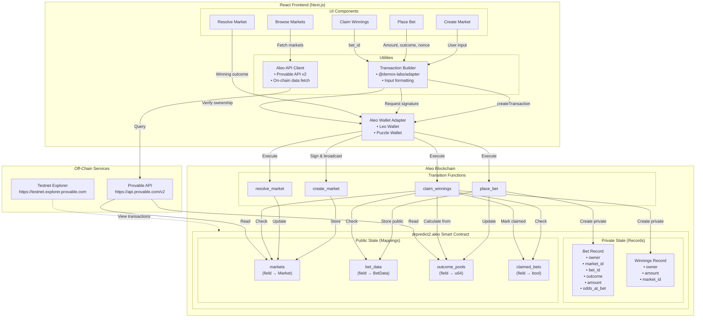

<div align="center">


# zkPredict

**Zero-Knowledge Private Prediction Markets on Aleo**

[Live Demo](https://zkpredict.lat/) · [Documentation](./CLAUDE.md) · [Smart Contract](#smart-contract-testnet) · [GitHub](https://github.com/carlos-israelj/zkPredict)

---

</div>

## Table of Contents

- [Overview](#overview)
- [Core Features](#core-features)
- [Technical Specifications](#technical-specifications)
- [How It Works](#how-it-works)
- [Architecture](#architecture)
- [Quick Start](#quick-start)
- [Smart Contract](#smart-contract-testnet)
- [Technology Stack](#technology-stack)
- [Real-World Use Cases](#real-world-use-cases)
- [Privacy Model](#privacy-model)
- [Roadmap](#roadmap)
- [FAQ](#frequently-asked-questions)
- [Contributing](#contributing)

---

## Overview

zkPredict is the **first fully private prediction market** on Aleo blockchain, enabling completely confidential betting on future events using Zero-Knowledge proofs. Unlike traditional prediction markets where all positions are visible, zkPredict keeps bet amounts, outcomes chosen, and winnings completely private while maintaining transparent market resolution.

### The Privacy Problem in Prediction Markets

Traditional blockchain-based prediction markets expose sensitive financial information:
- Everyone can see your bet amounts and positions
- Whale activity can manipulate market sentiment
- Your prediction accuracy and track record is public
- No financial privacy for participants

**zkPredict solves this** through Aleo's native Zero-Knowledge architecture, providing cryptographic privacy guarantees for all sensitive data while maintaining transparent and verifiable market outcomes.

---

## Core Features

zkPredict provides institutional-grade privacy for prediction markets through Aleo's Zero-Knowledge proof system:

### Private Betting
Place bets without revealing your position or amount. Bet records are encrypted and only visible to you, using Aleo's native Record system for complete confidentiality.

### Transparent Markets
Market outcomes, resolution status, and aggregate pool sizes are public for fair odds calculation. Privacy where it matters, transparency where it counts.

### Multi-Outcome Support
Create markets with 2-255 outcomes. Beyond simple binary YES/NO markets, support complex multi-choice predictions with cryptographic privacy.

### Bet ID System
Secure claim mechanism using cryptographic bet IDs derived from `BHP256::hash_to_field(nonce)`. Prevents double-claiming while maintaining unlinkability.

### Market Categories
Organized markets across Sports, Politics, Crypto, Weather, and custom categories. Discover and participate in markets matching your expertise.

### Zero-Knowledge Claims
Prove you won without revealing original bet details. The claim process verifies your winning position on-chain while keeping amounts and bet history private.

---

## Technical Specifications

| Component | Technology | Performance | Security |
|-----------|------------|-------------|----------|
| **ZK Proof System** | Aleo SNARK (AVM) | Native on-chain verification | 128-bit security |
| **Privacy Layer** | Aleo Records | Client-side encryption/decryption | Owner-only visibility |
| **Smart Contract** | Leo Language | Optimized for Aleo VM | Type-safe, formally verified |
| **Bet ID Generation** | BHP256 hash-to-field | Constant-time derivation | Collision-resistant |
| **Network** | Aleo Testnet | ~10-15s block time | Bitcoin-style PoW |
| **Transaction Cost** | ~0.1-0.2 credits | Per transaction (testnet) | Competitive with L1s |

---

## How It Works

zkPredict implements a privacy-preserving prediction market through three main phases:

### Phase 1: Market Creation

```
Creator defines:
  Market title and description
  End time (Unix timestamp)
  Number of outcomes (2-255)
  Category (Sports, Politics, Crypto, etc.)
  Auto-resolve flag

On-chain storage:
  Market struct stored in public mapping
  market_id = Field (unique identifier)
  Initial outcome pools = 0
```

**Result**: Market is live and discoverable. Anyone can place bets.

### Phase 2: Place Bet

```
User generates:
  nonce = random field (for bet_id uniqueness)
  bet_id = BHP256::hash_to_field(nonce)

User submits (public inputs):
  market_id, outcome, amount, nonce

Smart contract creates:
  Private Bet Record → Encrypted, only user can see
  BetData mapping → Stores bet info for claiming
  Update outcome_pools → Add amount to chosen outcome

Record contents (private):
  owner, market_id, bet_id, outcome, amount, odds_at_bet
```

**Result**: Bet is placed. User receives encrypted Bet record and bet_id. Nobody else can see bet details.

### Phase 3: Claim Winnings

```
Market creator resolves:
  Sets winning_outcome (0-255)
  Market marked as resolved

User claims:
  Inputs: bet_id (field)
  Contract verifies:
    1. bet_id exists in bet_data mapping
    2. Claimer is original bettor
    3. Market is resolved
    4. Chosen outcome matches winning_outcome
    5. bet_id not previously claimed

  Calculate payout:
    total_winning_pool = outcome_pools[winning_outcome]
    total_losing_pool = sum of all other pools
    user_payout = (amount / total_winning_pool) * total_losing_pool + amount

  Create Winnings Record → Private, contains payout amount
  Mark bet_id as claimed → Prevent double-claim
```

**Result**: Winnings transferred privately. No on-chain link between bet placement and claim.

### Privacy Guarantees

**Private Data** (Aleo Records - encrypted):
- Your bet amounts
- Which outcome you chose
- Your betting history
- Your winnings

**Public Data** (On-chain mappings):
- Market metadata (title, description, categories)
- Total pool sizes per outcome
- Market resolution status
- Winning outcome

**Key Security Properties**:
- **Confidentiality**: Records encrypted with view key, only owner can decrypt
- **Unlinkability**: bet_id derived from hash prevents correlation
- **Double-Spend Prevention**: Nullifier pattern via claimed_bets mapping
- **Verifiability**: All claims verified on-chain with Zero-Knowledge proofs

---

## Architecture



---

## Quick Start

### Prerequisites

- **Node.js** v18+ and **Yarn** ([Download](https://nodejs.org/))
- **Leo CLI**: `curl -L https://install.leo.app | bash`
- **Aleo Wallet**: [Leo Wallet](https://leo.app/) or [Puzzle Wallet](https://puzzle.online/)
- **Testnet Credits**: Get from [Aleo Faucet](https://faucet.aleo.org/)

### Installation

```bash
# Clone the repository
git clone https://github.com/carlos-israelj/zkPredict.git
cd zkPredict

# Install frontend dependencies
yarn install

# Build the Leo smart contract (optional - already deployed)
cd program
leo build
cd ..

# Start development server
yarn dev
```

**Access the application:**
- Frontend: http://localhost:3000
- Live deployment: https://zkpredict.lat

---

## Smart Contract (Testnet)

### Deployed Contract

| Contract | Program ID | Network | Explorer |
|----------|-----------|---------|----------|
| **zkpredict2.aleo** | `zkpredict2.aleo` | Aleo Testnet | [View on Explorer](https://testnet.explorer.provable.com/program/zkpredict2.aleo) |

### Transaction Details

| Metric | Value |
|--------|-------|
| **Deployment TX** | `at1uaezw9wsrskwex086wu6aj6ryas6m6eq90xn5qydwj7ymlva2qgstgl3vt` |
| **Deployment Cost** | 6.908620 credits |
| **Variables** | 130,407 |
| **Constraints** | 101,213 |
| **Deployed** | January 30, 2026 |

### Contract Functions

**create_market** - Create a new prediction market
```leo
transition create_market(
    public market_id: field,
    public end_time: u32,
    public num_outcomes: u8,
    public category: u8,
    public auto_resolve: bool
) -> Future
```

**place_bet** - Place a private bet on an outcome
```leo
transition place_bet(
    public market_id: field,
    public outcome: u8,
    public amount: u64,
    public nonce: field  // For bet_id generation
) -> (Bet, Future)
```

**resolve_market** - Resolve market with winning outcome (creator only)
```leo
transition resolve_market(
    public market_id: field,
    public winning_outcome: u8,
    public current_time: u32
) -> Future
```

**claim_winnings** - Claim winnings with bet_id
```leo
transition claim_winnings(
    public bet_id: field
) -> (Winnings, Future)
```

---

## Technology Stack

### Core Infrastructure

| Layer | Technology | Version | Role |
|-------|------------|---------|------|
| **Blockchain** | Aleo Mainnet | Testnet | Zero-Knowledge L1 blockchain |
| **Smart Contract** | Leo Language | Latest | Privacy-preserving contract logic |
| **Proof System** | Aleo SNARK | AVM native | Zero-Knowledge proofs |
| **Consensus** | AleoBFT + PoW | Hybrid | Network security |

### Application Stack

| Component | Technology | Version | Function |
|-----------|------------|---------|----------|
| **Frontend Framework** | Next.js | 13+ | React with App Router |
| **Language** | TypeScript | 5.x | Type-safe development |
| **Styling** | Tailwind CSS + DaisyUI | 3.x | Component-based UI |
| **Wallet Integration** | @demox-labs/aleo-wallet-adapter | Latest | Wallet connection and signing |
| **State Management** | React Query | 4.x | Server state caching |

---

## Real-World Use Cases

### Crypto Price Predictions
Bet on Bitcoin, Ethereum, or altcoin price targets without revealing your position. Private speculation on market movements with cryptographic unlinkability.

### Sports Betting
Predict sports outcomes with complete confidentiality. No public record of your bets or winning streaks - perfect for high-stakes sports predictions.

### Political Forecasting
Participate in election and political event markets without exposing your political views. Vote privately on outcomes while maintaining transparent resolution.

### Weather Markets
Predict temperature, rainfall, or natural events. Scientific forecasting with financial incentives and complete participant privacy.

### Custom Community Markets
Create niche markets for your community: tech product launches, social trends, or internal company predictions. Flexible outcome structures for any prediction scenario.

---

## Privacy Model

### What's Private

**Encrypted in Aleo Records:**
- Your bet amounts
- Which outcome you chose
- Your betting history
- Your winnings
- Your win/loss ratio

**Only you can see:**
- Your Bet records (decrypted with your view key)
- Your Winnings records
- Your complete betting history

### What's Public

**Visible on-chain:**
- Market metadata (title, description, end time)
- Total pool sizes per outcome (aggregate only)
- Market resolution status (resolved/unresolved)
- Winning outcome (after resolution)
- Market categories

**Cannot be linked:**
- Which address bet on which outcome
- How much each participant bet
- Who won and who lost
- Bet-to-claim correlation

### Privacy Guarantees

**Cryptographic Unlinkability**
- Bet IDs derived from `BHP256::hash_to_field(nonce)`
- No correlation between bet transaction and claim transaction
- Aleo's native ZK-SNARK system provides mathematical privacy

**Key Properties**:
- ✅ **Bet Confidentiality**: Amounts and outcomes encrypted in Records
- ✅ **Claim Privacy**: Winnings only visible to claimer
- ✅ **No Transaction Graph**: Cannot trace bet → claim relationship
- ✅ **Double-Spend Prevention**: bet_id nullifier prevents re-claiming
- ✅ **Non-Custodial**: Only bet_id owner can claim (cryptographic proof)

---

## Roadmap

### Phase 1: Foundation (Completed ✅)
**Status:** Deployed on Aleo Testnet
**Timeline:** Q4 2025 - Q1 2026

**Core Features**
- Binary and multi-outcome prediction markets (2-255 outcomes)
- Private betting with Aleo Records
- Bet ID system for secure claiming
- Market creation, resolution, and claiming
- Full Zero-Knowledge privacy guarantees

**Smart Contract**
- Leo program deployment (`zkpredict2.aleo`)
- Private Records (Bet, Winnings)
- Public Mappings (markets, bet_data, outcome_pools, claimed_bets)
- BHP256 hash-based bet ID generation

**Frontend**
- Next.js application with Aleo Wallet Adapter
- Create markets, place bets, resolve, and claim UI
- Market browsing with categories
- Transaction status tracking

**Current Status:** Live on testnet processing real bets with full privacy.

---

### Phase 2: Enhanced Features (Q2 2026)
**Focus:** User experience and market diversity

**Market Enhancements**
- Time-series markets (price at specific timestamps)
- Conditional markets (if X happens, what about Y?)
- Market templates for common prediction types
- Market search and filtering

**Privacy Improvements**
- Fixed-denomination betting pools (hide amounts)
- Batch claiming for multiple bets
- Privacy-preserving market analytics

**UI/UX**
- Mobile-responsive design optimization
- Progressive Web App (PWA) support
- Market recommendations
- Portfolio tracking (private)

**Infrastructure**
- Off-chain metadata storage (IPFS)
- Market image uploads
- Enhanced API for market discovery
- Performance optimization

---

### Phase 3: Ecosystem & Integrations (Q3-Q4 2026)
**Focus:** Ecosystem growth and advanced features

**Oracle Integration**
- Chainlink oracle support for price feeds
- Automated market resolution via oracles
- Weather API integration
- Sports results API integration

**DeFi Features**
- Liquidity provision for market makers
- Automated market making (AMM) pools
- Yield farming on pool deposits
- Cross-chain asset support

**Developer Tools**
- zkPredict SDK for third-party integrations
- Market creation API
- Embeddable market widgets
- GraphQL API for data queries

**Long-Term Vision:** Establish zkPredict as the leading private prediction market platform on Aleo, enabling confidential forecasting at scale.

---

## Frequently Asked Questions

### General

**Q: What makes zkPredict different from traditional prediction markets?**
A: zkPredict uses Aleo's Zero-Knowledge proofs to provide mathematical privacy guarantees. Your bet amounts, positions, and winnings are cryptographically hidden, unlike traditional markets where all data is public.

**Q: Can I recover my bet if I lose my bet_id?**
A: No. The bet_id is the only way to prove ownership of a bet for claiming. Store it securely - zkPredict cannot recover lost bet_ids. We recommend saving it immediately after placing a bet.

### Privacy

**Q: Can anyone see what I bet?**
A: No. Your bet amount and outcome choice are encrypted in Aleo Records. Only you can decrypt them with your wallet's view key. On-chain observers only see aggregate pool totals.

**Q: How is my bet_id generated?**
A: Your bet_id is derived as `BHP256::hash_to_field(nonce)` where nonce is a random value you provide. This creates a unique identifier unlinkable to your bet details.

### Technical

**Q: Why use Aleo instead of other blockchains?**
A: Aleo provides native Zero-Knowledge proof support at the VM level. Privacy is built into the blockchain, not bolted on. Records are encrypted by default, and all computation is verified with SNARKs.

**Q: Can I place multiple bets on the same market?**
A: Yes! Each bet uses a different nonce, generating unique bet_ids. You can bet multiple times on different outcomes or the same outcome.

---

## Contributing

Contributions are welcome! zkPredict is open-source and community-driven.

### Development Workflow

1. Fork the repository
2. Create your feature branch (`git checkout -b feature/AmazingFeature`)
3. Commit your changes (`git commit -m 'feat: add amazing feature'`)
4. Push to the branch (`git push origin feature/AmazingFeature`)
5. Open a Pull Request

---

## Resources

### Official Documentation
- [Aleo Documentation](https://developer.aleo.org)
- [Leo Language Guide](https://developer.aleo.org/leo)
- [Aleo Wallet Adapter](https://github.com/demox-labs/aleo-wallet-adapter)
- [Provable API](https://api.provable.com/docs)

### Community
- [Aleo Discord](https://discord.gg/aleo)
- [GitHub Issues](https://github.com/carlos-israelj/zkPredict/issues)

---

## License

This project is licensed under the MIT License - see the [LICENSE](LICENSE) file for details.

---

## Team

**Lead Developer**: Carlos Israel Jiménez
**GitHub**: [@carlos-israelj](https://github.com/carlos-israelj)

---

## Acknowledgments

zkPredict builds upon foundational work from:

- **Aleo Foundation** - Zero-Knowledge blockchain infrastructure and Leo language
- **Demox Labs** - Aleo Wallet Adapter for seamless wallet integration
- **Provable** - Blockchain explorer and API services
- **Aleo Community** - Technical feedback, testing, and support

---

<div align="center">

**Built on Aleo · Powered by Zero-Knowledge · Secured by Mathematics**

---

*Privacy is a fundamental right. zkPredict protects yours.*

**© 2026 zkPredict** · Licensed under [MIT](./LICENSE)

</div>
